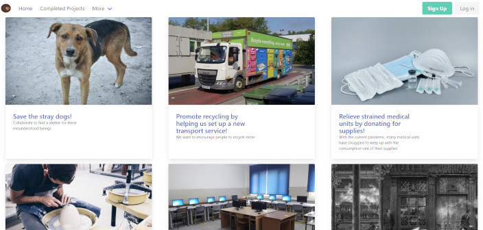

Agaclipsia 
==========

The project will be a crowdfunding platform for charitable and donation-worthy projects.

Users will be able to both donate and create projects (charitable initiatives).
Both anonymous and public (visible to all) donations will be supported.

Example (Displaying all active projects)
----------------------------------------

Technologies used
-----------------

- Java & Spring Boot for the server/API
- React.js for the front-end (with Bulma CSS framework)
- TypeScript for better type safety with JS code
- MySQL for persisting data

Usage
-----
Add environment variables for a new MySQL database (e.g. ``MYSQL_DATABASE, MYSQL_USERNAME, MYSQL_PASSWORD``) before launching the Maven project.

The client-side app can be started by running ``npm start`` inside ``react-ts/sweet-eclipse`` after 
all dependencies have been installed (e.g. ``npm install``).

TODO
----
- [x] <del>Integrate with Stripe API</del> (see ``development`` branch)
  - [ ] Handle more error cases 
  - [ ] Use Stripe Connect to create Custom Accounts for projects
- [x] <del>Find a storage solution for images</del> (Using AWS S3 - see ``aws_image_storage`` branch)
  - [ ] Implement front-end upload of images
- [ ] Package the client code (``npm run build``, update CORS etc.) and deploy 
